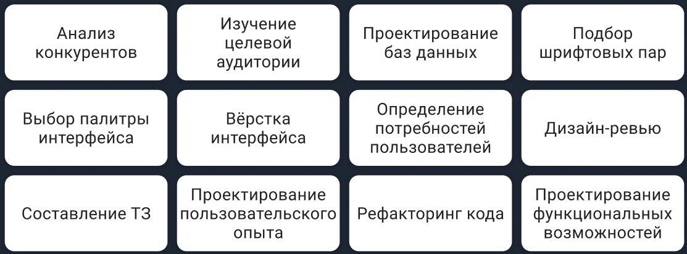

# UX/UI-дизайн и UX/UI-дизайнер

В этом проекте Вы узнаете, что такое UX-, UI-дизайн, чем занимается UX/UI-дизайнер и его основные этапы работы

## Contents

1. [Chapter I](#chapter-i)\
    1.1. [Общая инструкция](#общая-инструкция)
2. [Chapter II](#chapter-ii) \
    2.1. [UX/UI-дизайн](#ux/ui-дизайн) \
    2.2. [UX-дизайн](#ux-дизайн) \
    2.3. [UI-дизайн](#ui-дизайн)
3. [Chapter III](#chapter-iii) \
    3.1. [UX/UI-дизайнер](#ux/ui-дизайнер)
4. [Chapter IV](#chapter-iv) \
    4.1. [Пайплайн работы](#пайплайн-работы) \
    4.2. [Task 1](#task-1) \
    4.3. [Task 2](#task-2) 

## Chapter I

### Общая инструкция

Методология Школы 21 может быть не похожа на тот образовательный опыт, который с вами случался ранее. 
Ее отличает высокий уровень автономии: у вас есть задача, вы должны ее выполнить. 
По большей части вам нужно будет самим добывать знания для ее решения. Второй важный момент – это peer-to-peer обучение. 
В образовательном процессе нет преподавателей и экспертов, перед которыми вы защищаете свой результат. 
Вы это делаете перед такими же учащимися, как и вы сами. 
У них есть чек-лист, который поможет им выполнить приемку вашей работы качественно.

Роль Школы 21 заключается в том, чтобы обеспечить через последовательность заданий и оптимальный уровень поддержки 
такую траекторию обучения, при которой вы освоите не только hard skills, но и научитесь самообучаться.

* Не доверяйте слухам и предположениям о том, как должно быть оформлено ваше решение. Этот документ является единственным источником, к которому стоит обращаться по большинству вопросов.
* Ваше решение будет оцениваться другими учащимися.
* Подлежат оцениванию только те файлы, которые вы выложили в GIT, **ветка develop, папка src.**
* В вашей папке не должно быть лишних файлов – только те, что были указаны в задании.
* Есть вопрос? Спросите коллегу справа. Не помогло? Спросите коллегу слева.
* Не забывайте, что у вас есть доступ к интернету и поисковым системам.
* Обсуждение заданий можно вести и в Slack.
* Будьте внимательны к примерам, указанным в этом документе – они могут иметь важные детали, которые не были оговорены другим способом.
* И да пребудет с вами Сила!

## Chapter II

### UX/UI-дизайн

В нашей жизни мы постоянно встречаемся с различными интерфейсами. Сайты, веб и десктопные приложения, приложения для телефонов, смарт-часов, смарт-телевизоров, интерактивных навигационных панелей в торговых центрах имеют интерфейс, с которым мы взаимодействуем.

UX/UI-дизайн, это направление дизайна, которое занимается созданием и улучшением интерфейсов.

#### UX-дизайн

UX-дизайн, это обширная часть дизайна интерфейсов.

UX расшифровывается как User eXperience или пользовательский опыт. UX описывает пользовательский опыт как целое, принимая во внимание не только пользовательские взаимодействия с определенным сайтом или приложением, но также, их чувства по отношению к продукту или бренду, и то, удовлетворяет ли он их потребностям.

В UX-дизайне акцент идёт на удобство использования, которое достигается за счёт изучения пользователя и его поведенческих особенностей и использования полученных данных для проектирования интерфейса.

#### UI-дизайн

UI расшифровывается как User Interface или пользовательский интерфейс. UI отвечает за внешний вид интерфейса. Как будут выглядеть элементы, какой будет цвет и шрифт в интерфейсе, всё это определяет UI-дизайн.

## Chapter III

### UX/UI-дизайнер

Ввиду различий UX и UI дизайна, можно встретить UX-дизайнеров и UI-дизайнеров, однако чаще UX/UI-дизайн предполагает специалиста сразу в двух областях.

UX/UI-дизайнер занимается разработкой интерфейса от момента формирования идеи до момента подготовки макетов для разработчиков.

## Chapter IV

### Пайплайн работы

Всё больше интерфейсов проектируются по принципу Human-centred design'а.

Human-center design, это человеко-ориентированное проектирование пригодных в использовании и полезных интерактивных систем с учётом особенностей пользователей и их потребностей на основе эргономических принципов.

Пайплайн работы UX/UI-дизайнера выглядит следующим образом:
* сбор информации;
* исследование;
* проектирование интерфейса;
* создание и тестирование прототипа;
* визуальная проработка интерфейса.

Иногда, после тестирования прототипа возникает потребность снова вернуться к пунктам до него, вплоть до сбора информации.

### Task 1

* создайте файл pipeline формата .md или .txt ;
* опишите в файле pipeline какие цели у каждого этапа пайплайна работы UX/UI-дизайнера;
* опишите в файле pipeline какие результаты получаются после каждого этапа пайплайна работы UX/UI-дизайнера;
* поместите файл pipeline в репозиторий.

### Task 2

* ниже представлен набор различных задач, встречающихся при создании продукта:

* создайте файл uxui-tasks формата .md или .txt;
* выпишите в файл uxui-tasks те задачи, которыми занимается UX/UI-дизайнер;
* укажите рядом с каждой задачей, к какому типу дизайна она относится, UX- или UI- дизайну;
* поместите файл uxui-tasks в репозиторий.

💡 [Нажми здесь](https://forms.gle/cRAnogcwYVHzuS49A) **чтобы отправить обратную связь по проекту**. 

