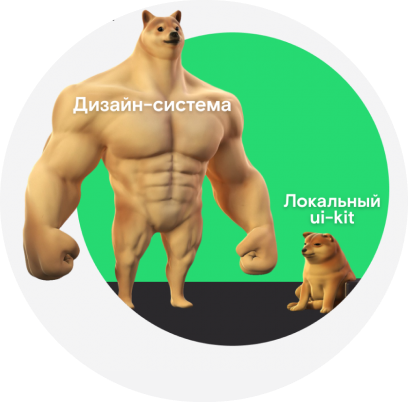
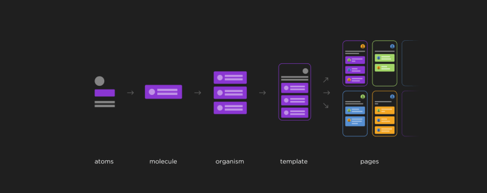
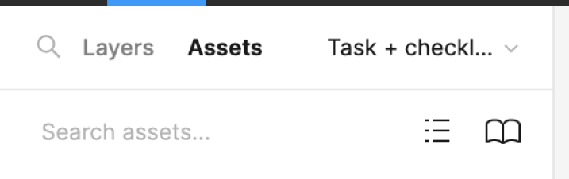
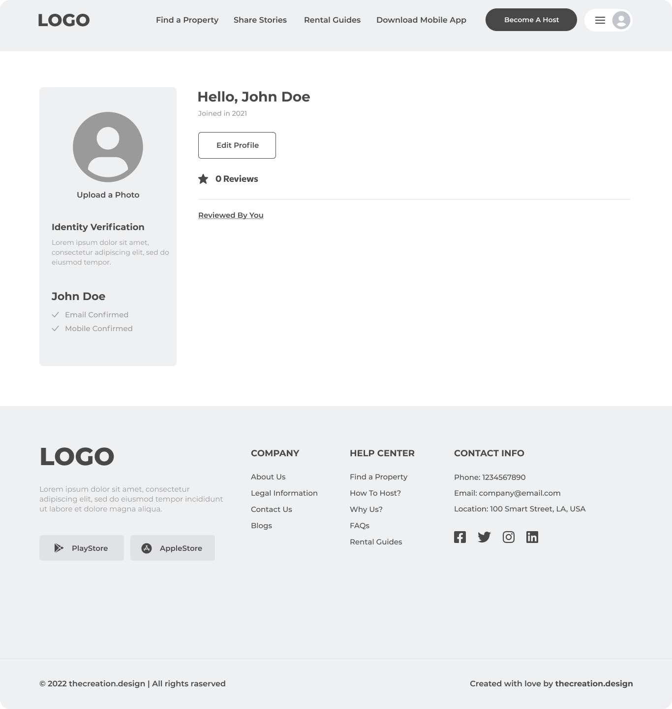
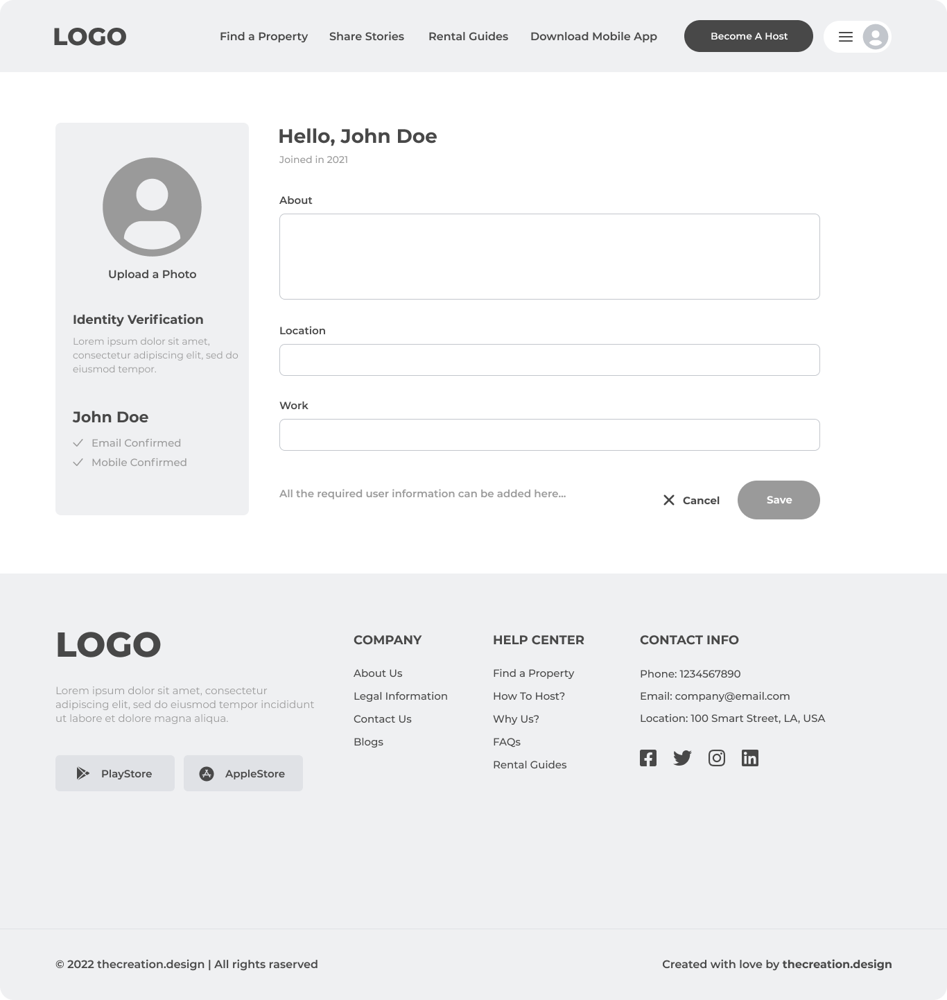
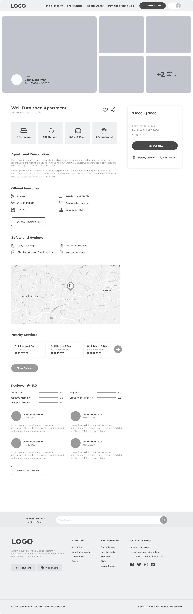
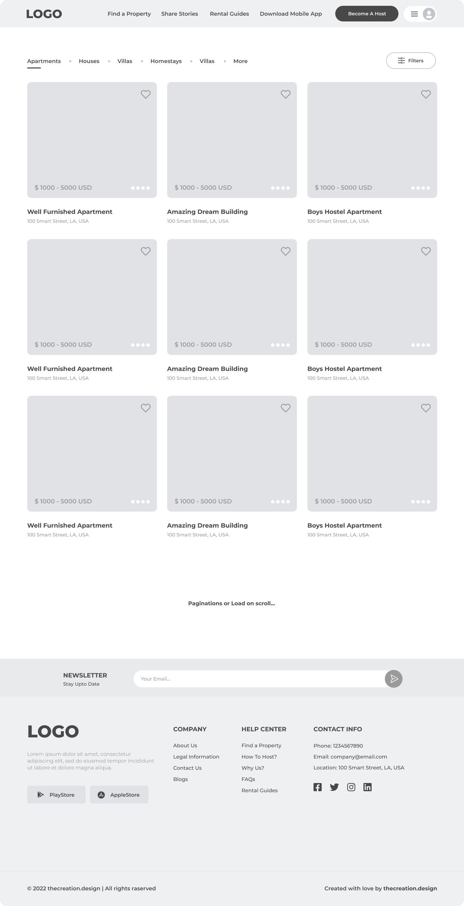
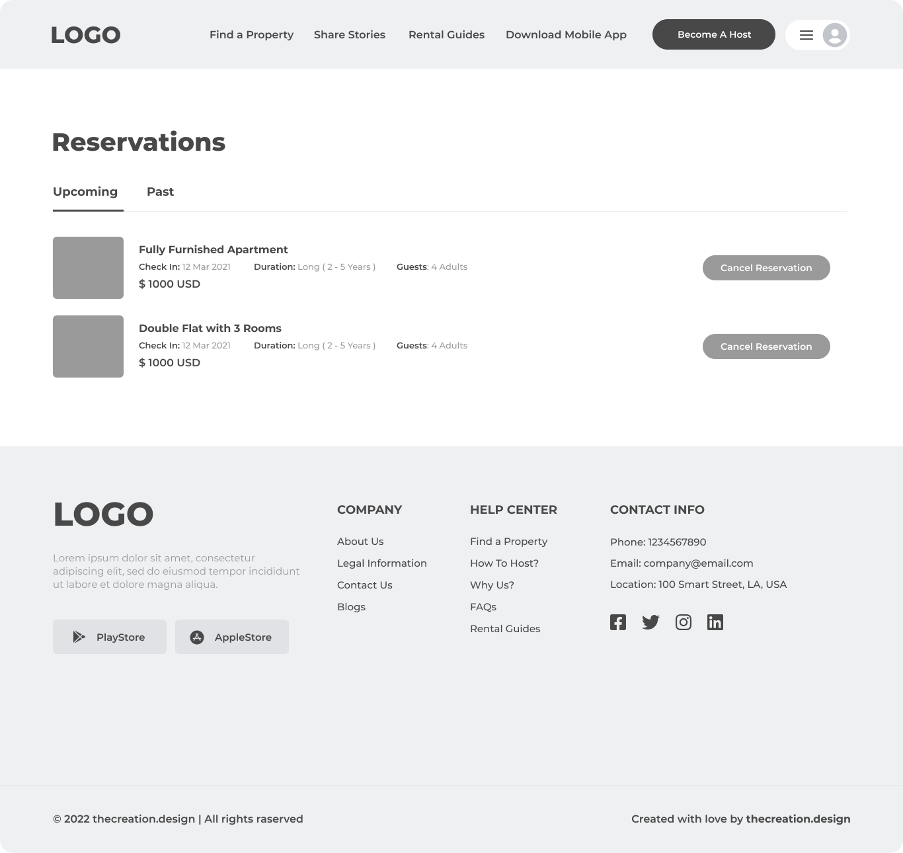
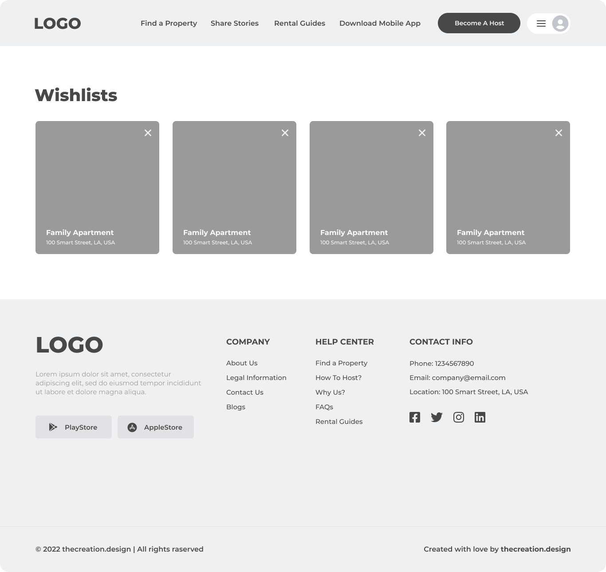

# Дизайн-система и UI-kit
Узнаете, что такое UI-kit и дизайн-система, зачем они нужны и как они применяются при создании интерфейсов

## Contents

1. [Chapter I](#chapter-i) \
    1.1. [Общая инструкция](#общая-инструкция) 
2. [Chapter II](#chapter-ii) \
    2.1. [UI-kit](#ui-kit) \
    2.2. [Дизайн система](#дизайн-система) 
3. [Chapter III](#chapter-iii) \
    3.1. [Атомарный дизайн](#атомарный-дизайн) 
4. [Chapter IV](#chapter-iv) \
    4.1. [Компоненты и наследование в Figma](#компоненты-и-наследование-в-figma) \
    4.2. [Task 1](#task-1) \
    4.3. [Task 2](#task-2)

<h2 id="chapter-i">Chapter I</h2> 
<h3 id="общая-инструкция">Общая инструкция</h3>

Методология Школы 21 может быть не похожа на тот образовательный опыт, который случался с тобой ранее. Её отличает высокий уровень автономии: у тебя есть задача, ты должен её выполнить. По большей части тебе нужно будет самому добывать знания для её решения. Второй важный момент — это peer-to-peer обучение. В образовательном процессе нет менторов и экспертов, перед которыми ты защищаешь свой результат. Ты это делаешь перед такими же учащимися, как и ты сам. У них есть чек-лист, который поможет им качественно выполнить приемку вашей работы.

Роль Школы 21 заключается в том, чтобы обеспечить через последовательность заданий и оптимальный уровень поддержки такую траекторию обучения, при которой ты не только освоишь hard skills, но и научишься самообучаться.

- Не доверяй слухам и предположениям о том, как должно быть оформлено ваше решение. Этот документ является единственным источником, к которому стоит обращаться по большинству вопросов;
- твое решение будет оцениваться другими учащимися;
- подлежат оцениванию только те файлы, которые ты выложил в GIT (ветка develop, папка src);
- в твоей папке не должно быть лишних файлов — только те, что были указаны в задании;
- не забывай, что у вас есть доступ к интернету и поисковым системам;
- обсуждение заданий можно вести и в Slack;
- будь внимателен к примерам, указанным в этом документе — они могут иметь важные детали, которые не были оговорены другим способом;
- и да пребудет с тобой Сила!

<h2 id="chapter-ii">Chapter II</h2>

В прошлом проекте ты “применял” UI к каркасам экранов своего сервиса.

В этом проекте мы рассмотрим инструмент,  который помогает UX/UI-дизайнеру в создании интерфейсов.

<h3 id="ui-kit">UI-kit</h3>

UI-kit — это набор готовых решений пользовательского интерфейса. Это могут быть отдельные элементы, формы, цветовые стили, стили типографики и т.д.

UI-kit необходим для удобства работы над интерфейсом в команде, поскольку все дизайнеры будут использовать одни и те же элементы интерфейса, а не создавать каждый свои собственные с нуля, проделывая лишнюю работу. Также UI-kit помогает соблюдать консистентность дизайна – собранные по единым правилам и в одном стиле компоненты будут одинаково выглядеть у всех участников дизайн-команды.

UI-kit позволяет соблюдать фирменный стиль от проекта к проекту.

Необязательно создавать собственный UI-kit, особенно в условиях ограниченного времени. Готовый UI-kit можно купить или скачать бесплатно на специализированных ресурсах для дизайнеров. Многие известные компании имеют свои UI-kit'ы в публичном доступе.

<h3 id="дизайн-система">Дизайн-система</h3>

Дизайн-система – это более комплексное решение, включающее в себя UI-kit.

Также дизайн-система содержит правила и рекомендации по работе сетками и отступами; компонентами и стилями; редполитику и правила коммуникации; гайдлайны; шаблоны проектирования страниц; сложные компоненты, реализованные в коде и т.д.

<h2 id="chapter-iii">Chapter III</h2>

<h3 id="атомарный-дизайн">Атомарный дизайн</h3>

Наиболее распространённой методологией создания дизайн-систем является **атомарный дизайн**.

Эта система содержит информацию о компонентах интерфейсов и дает возможность быстрее переходить от абстрактного уровня к конкретному.

Методология строится на аналогии между интерфейсами и химией: точно так же, как все вещества во Вселенной состоят из атомов, все интерфейсы состоят из компонентов. Эти элементы можно разложить на 5 уровней.

* Атом – самый маленький и обособленный элемент интерфейса (кнопка, чекбокс и т.д.). Цвета и шрифты тоже являются атомами;
* Молекула – комбинация атомов. Например, карточка из проекта 2;
* Организм – комбинации молекул, составляющие более крупные элементы интерфейса. Например, список карточек продуктов в интернет-магазине, это набор молекул-карточек продуктов, объединённых в одно целое;
* Шаблон – элементы из нескольких организмов, каркас страницы, ее прототип;
* Страница – это последняя стадия с актуальным контентом, на которой проверяется эффективность всей дизайн-системы.

<h2 id="chapter-iv">Chapter IV</h2>

<h3 id="компоненты-и-наследование-в-figma">Компоненты и наследование в Figma</h3>

Для создания UI-kit'ов и дизайн-систем Figma используются компоненты ❖. Компонент – это элемент или блок, который можно редактировать комплексно.

Создав компонент один раз, его копии можно использовать в разных частях проекта. А любые изменения, внесенные в мастер-компонент, автоматически применяются к его экземплярам.

Например, если вы нарисуете кнопку и сделаете из нее компонент, а потом создадите ее экземпляры (копии), то при изменении цвета, размера и других параметров мастер-компонента экземпляр будет изменяться соответственно.

Компоненты можно создавать с разным уровнем вложенности, т.е. один компонент может содержать в себе экземпляры другого компонента. Например, компонент карточки товара может содержать в себе компоненты заголовка, изображения, иконки, кнопки, и т.д.

В одном мастер-компоненте можно создать несколько вариантов, а в экземпляре переключать их с помощью свойств. С помощью Variants можно создавать неограниченное количество вариантов для компонента и с помощью этого отобразить, например, все состояния кнопок и использовать их в макетах в зависимости от задачи. При создании вариантов важно сохранять одинаковое наименование слоев, чтобы при переключении варианта в экземпляре не был потерян контент и замена происходила корректно.

Так же Figma позволяет достаточно гибко настраивать компонент с помощью Boolean (включение/выключение видимости слоев компонента), Instance Swap (изменение вложенного компонента), Text (текстовое наполнение компонента).

Для того, чтобы использовать созданные компоненты в своих проектах, нужно опубликовать библиотеку с помощью опции Publish Library на панели инструментов, и подключить в другом файле с макетами опубликованную библиотеку в списке Libraries на панели Assets.

<h3 id="task-1">Task 1</h3>

В прошлом проекте ты начал создавать UI-кит своего проекта, создав стили цветов и типографики. Сейчас тебе предстоит перейти к работе над дизайн-системой. В больших проектах над дизайн-системой часто работает команда дизайнеров.

* создайте design-файл “ui-kit”;
* распределите в команде создание компонентов по заданным вайрфреймам. Придерживайтесь атомарной методологии;
* для хранения стилей цветов и типографики используйте Local Styles;
* обязательными компонентами вашего UI-kit'а будут кнопки, поля ввода, карточки....;
* для интерактивных компонентов создайте варианты для отображения их возможных состояний (Default, Hover, Active, Disabled);
* опубликуйте созданную библиотеку (в бесплатной версии доступна публикация только стилей, а также доступ к этой библиотеке будет локальный).

<h3 id="task-2">Task 2</h3>

* распределите между участниками команды все вайрфреймы из задания 1 (количество может быть распределено не поровну; каждый участник может дополнительно взять вайрфреймы других участников команды);
* перенесите изображения вайрфреймов в файл "ui-kit";
* создайте экраны приложения на основе вайрфеймов из задания 1, используя стили и компоненты созданного ранее UI-kit'a (располагайте экраны с реализованным ui рядом с изображением файрфрейма);
* экспортируйте файл "ui-kit" в формате .fig и загрузите его в папку репозитория.

💡 [Нажми здесь](https://forms.gle/kF6DxzDsyCRqXLzT6) **чтобы отправить обратную связь по проекту**. 

